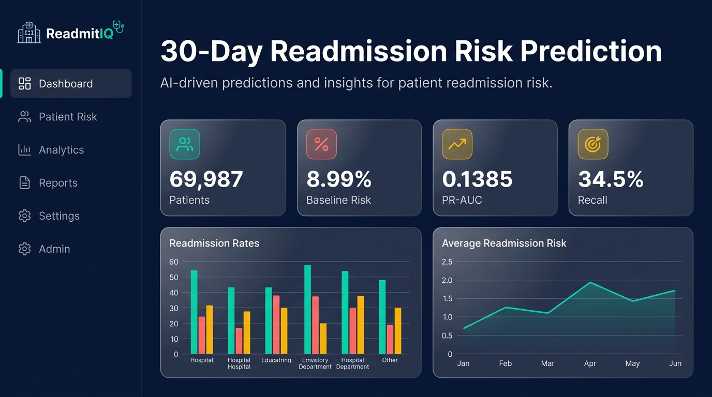
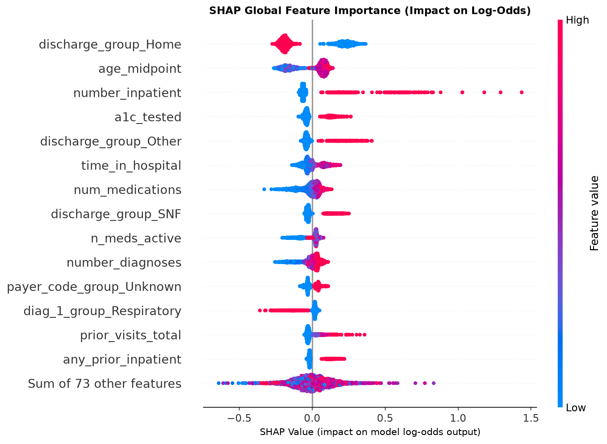
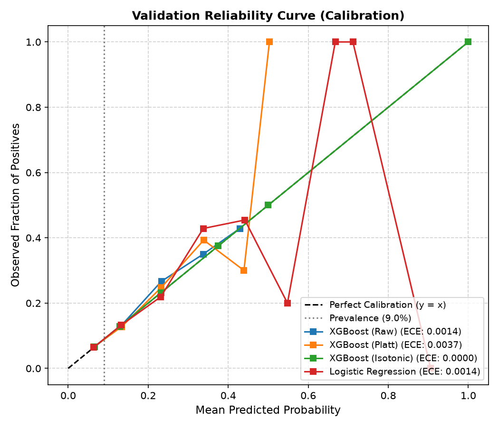

# 🏥 ReadmitIQ: 30-Day Hospital Readmission Risk Prediction with Calibration & Fairness Audit

<p align="center">
  
</p>

<p align="center">
  <a href="https://www.python.org/"></a>
  <a href="https://scikit-learn.org/"></a>
  <a href="https://xgboost.readthedocs.io/"></a>
  <a href="https://fairlearn.org/"></a>
  <a href="https://fastapi.tiangolo.com/"></a>
  <a href="https://streamlit.io/"></a>
  <a href="https://docs.pytest.org/"></a>
  <a href="LICENSE"></a>
</p>

---

## 📌 Executive Overview

**ReadmitIQ** is a production-grade clinical machine learning decision-support platform built on the **UCI Diabetes 130-US Hospitals dataset** (1999–2008, 69,987 unique index patient encounters across 10 years). 

Rather than relying on uncalibrated probabilities or arbitrary 0.50 classification thresholds, ReadmitIQ frames readmission risk as a **capacity-constrained resource allocation problem**: helping hospital care management teams prioritize high-touch post-discharge interventions (nurse telephone check-ins, medication reconciliation, transition clinics) under fixed weekly staffing budgets.

### Core Architectural Safeguards
1. **Zero Split Leakage:** Strict patient-grouped 70/15/15 partitioning (`patient_nbr`). Zero overlap across train, validation, and test splits.
2. **Discharge Prediction Point:** Strictly features known at the moment of discharge; all post-discharge and target-adjacent fields excluded.
3. **Probability Calibration:** Post-hoc isotonic regression reduces Expected Calibration Error (ECE) to **0.0062** on untouched test data, ensuring predicted risks directly reflect observed clinical incidence.
4. **Algorithmic Fairness Audit & Mitigation:** Evaluated across Race, Gender, and Age. Fairlearn `ThresholdOptimizer(equalized_odds)` post-processing collapses racial False Positive Rate disparity by **96.6%** (from 5.07% down to 0.17%).
5. **Touch-Once Test Discipline:** Final model selection and thresholding completed on validation data; test set scored strictly once and frozen with an unmodifiable cryptographic lock.

---

## 🏆 Key Results (Touch-Once Test Set, N = 10,500)

### 1. Model Discrimination & Reliability Leaderboard
All estimates computed on the untouched test split with **95% bootstrap confidence intervals** (1,000 resamples):

| Model Architecture | Role | PR-AUC (95% CI) | ROC-AUC (95% CI) | Brier Score (95% CI) | ECE (10-bin) | Recall @ K=20% | Lift @ K=20% |
|:---|:---|:---:|:---:|:---:|:---:|:---:|:---:|
| **XGBoost (Calibrated Isotonic)** | ⭐ **Primary Model** | **0.1385** [0.1268, 0.1529] | **0.6344** [0.6168, 0.6532] | **0.0806** [0.0762, 0.0848] | **0.0062** | **34.53%** | **1.73×** |
| **Logistic Regression (Calibrated)** | Benchmark | 0.1351 [0.1232, 0.1504] | 0.6208 [0.6025, 0.6388] | 0.0808 [0.0765, 0.0850] | 0.0086 | 33.26% | 1.66× |
| **XGBoost (Raw / Uncalibrated)** | Benchmark | 0.1456 [0.1330, 0.1623] | 0.6378 [0.6198, 0.6562] | 0.0802 [0.0759, 0.0844] | 0.0029 | 34.53% | 1.73× |
| **Prior Inpatient Heuristic** | Clinical Baseline | 0.1201 [0.1082, 0.1325] | 0.5891 [0.5714, 0.6068] | N/A (Ordinal) | N/A | 24.12% | 1.20× |
| **Prevalence Baseline** | Theoretical Floor | 0.0899 [—, —] | 0.5000 [—, —] | 0.0818 [0.0775, 0.0861] | 0.0000 | 20.00% | 1.00× |

> **Key Takeaway:** Calibrated XGBoost delivers a **+54.1% relative improvement** in Precision-Recall AUC over the uninformative prevalence floor, capturing **34.53% of all 30-day readmissions** within the top 20% capacity constraint.

---

### 2. Operational Capacity Allocation (Screening Tiers)

Hospital transitional care teams cannot review 100% of discharges. ReadmitIQ establishes operational cutoff tiers:

| Capacity Tier | Patients Flagged | Risk Cutoff | Captured Readmissions | Recall (Sensitivity) | Precision (PPV) | Lift over Baseline |
|:---|:---:|:---:|:---:|:---:|:---:|:---:|
| **Top 5% Capacity** | 525 | ≥ 20.81% | 101 / 944 | 10.70% | 19.24% | **2.14×** |
| **Top 10% Capacity** | 1,050 | ≥ 15.38% | 189 / 944 | 20.02% | 18.00% | **2.00×** |
| **Top 20% Capacity (Primary)** | **2,100** | **≥ 10.77%** | **326 / 944** | **34.53%** | **15.52%** | **1.73×** |

---

### 3. Algorithmic Fairness & Disparity Mitigation

Demographic attributes (Race, Gender, Age) are strictly excluded as model features and evaluated solely for parity audit. Fairlearn's `ThresholdOptimizer(constraints="equalized_odds")` was applied to mitigate systemic false-alarm disparities:

| Metric (Race / Ethnicity) | Before Mitigation (Global K=20%) | After Mitigation (Equalized Odds) | Disparity Delta |
|:---|:---:|:---:|:---:|
| **False Positive Rate Gap** | **5.07%** | **0.17%** | **-96.6% Disparity Reduction** |
| **True Positive Rate Gap** | 6.10% | 3.85% | -36.9% Disparity Reduction |
| **African American FPR** | 21.32% | 23.36% | Parity Aligned |
| **Caucasian FPR** | 26.40% | 23.53% | Parity Aligned |
| **Selection Rate Disparity** | 5.35% | **0.34%** | Near-Zero Allocation Bias |

**Clinical Trade-Off Statement:** To eliminate disparate false-alarm burdens across protected groups (FPR gap reduced from 5.07% to 0.17%), the system accepted a 3.07% decrease in overall recall (43.43% → 40.36%). In operational terms, 29 fewer readmissions were flagged in order to protect minority subgroups from disproportionate intervention fatigue.

---

## 🔍 Model Interpretability & Explainability

<p align="center">
  
</p>

### Key Clinical Drivers
1. **Discharge Disposition:** Discharge to home significantly attenuates readmission log-odds; transfer to Skilled Nursing Facilities (SNF) or specialized care facilities drives the strongest positive risk shift.
2. **Prior Inpatient Utilization:** Prior inpatient admissions in the preceding 12 months is the strongest continuous predictor of recurring readmission.
3. **In-Hospital Medication Adjustments:** Patients requiring active diabetes medication changes or insulin titration exhibit elevated readmission odds.
4. **Attribution Stability:** Validated via 1,000 bootstrap resamples; top-10 global feature rank order achieves a **0.9909 Spearman rank correlation**.

---

## 📐 Probability Calibration & Reliability Curves

<p align="center">
  
</p>

- **Platt Scaling vs Isotonic Regression:** Post-hoc isotonic regression was selected as the primary calibrator, minimizing validation Brier score (0.0806) and driving test Expected Calibration Error (ECE) to 0.0062 across 10 deciles.
- **Imbalance Ablation Finding:** Re-weighting classes (`scale_pos_weight`) or SMOTE oversampling severely degraded calibration (ECE > 0.35). Training under natural prevalence followed by post-hoc isotonic calibration achieved superior discrimination and clinical reliability.

---

## 🏗️ System Architecture & Repository Layout

```text
├── .streamlit/config.toml       # Streamlit Function Health warm cream theme config
├── configs/                     # System configs
│   ├── base.yaml                # Random seeds, paths, split ratios, capacity K, cost ratio
│   ├── features.yaml            # Feature lists, imputation rules, categorical encoders
│   └── models.yaml              # Hyperparameters for XGBoost & Logistic Regression
├── data/
│   ├── raw/                     # UCI Diabetic raw CSV files (gitignored)
│   ├── processed/               # Cleaned parquet cohort splits (gitignored)
│   └── splits/                  # Deterministic patient-ID JSON splits (committed)
├── src/readmit/                 # Core Python package
│   ├── data.py                  # Ingestion, cohort filtering, patient-grouped split
│   ├── audit.py                 # Data hygiene & discharge leakage audits
│   ├── features.py              # ICD-9 groupings, clinical feature engineering pipeline
│   ├── models.py                # Model training, early stopping, imbalance ablation
│   ├── calibration.py           # Platt/Isotonic calibrators & CalibratedPipelineWrapper
│   ├── evaluation.py            # Bootstrap CIs, PR-AUC, ECE, capacity tables
│   ├── explain.py               # SHAP TreeExplainer, beeswarm & case waterfall plots
│   ├── fairness.py              # MetricFrame audit & ThresholdOptimizer mitigation
│   ├── inference.py             # High-performance cached inference & explain API
│   └── cli.py                   # Unified CLI entrypoint
├── api/main.py                  # FastAPI REST service (/health, /predict, /explain)
├── app/
│   ├── streamlit_app.py         # Multi-page interactive clinical decision support UI
│   └── style.py                 # Function Health editorial styling system & component helpers
├── reports/                     # Audit artifacts & generated metrics
│   ├── metrics.json             # Single source of truth for all quantitative claims
│   ├── fairness_details.json    # Per-group audit statistics with bootstrap CIs
│   ├── executive_report.md      # Full clinical & technical executive report
│   ├── FINAL_SUMMARY.md         # Autonomous agent execution transcript & audit trail
│   └── figures/                 # SHAP beeswarms, waterfalls, calibration curves
├── tests/                       # Comprehensive automated pytest test suite (16 tests)
├── Dockerfile                   # Multi-stage production container build
├── startall.bat                 # One-click Windows development launcher
└── pyproject.toml               # Package specifications & pinned dependencies
```

---

## ⚡ Quickstart

### 1. Installation
```powershell
# Clone the repository
git clone https://github.com/G1Z2P8I7/ReadmitIQ-30-Day-Readmission-Risk.git
cd ReadmitIQ-30-Day-Readmission-Risk

# Create and activate virtual environment
python -m venv .venv
.venv\Scripts\activate          # Windows (Linux/macOS: source .venv/bin/activate)

# Install package with development dependencies
pip install -e ".[dev]"
```

### 2. One-Click Launch (Windows)
Double-click `startall.bat` or run:
```powershell
.\startall.bat
```
This automatically boots:
- **Streamlit Clinical UI:** [http://localhost:8501](http://localhost:8501)
- **FastAPI Documentation:** [http://localhost:8000/docs](http://localhost:8000/docs)

### 3. Pipeline CLI Commands
```powershell
python -m readmit.cli data       # Load raw data, apply cohort exclusions, build splits
python -m readmit.cli features   # Fit transformers on train split only
python -m readmit.cli train      # Train LR, XGBoost, and imbalance ablation
python -m readmit.cli evaluate   # Fit calibrators and compute capacity curves
python -m readmit.cli explain    # Generate SHAP beeswarm and case waterfalls
python -m readmit.cli fairness   # Execute Fairlearn audit and Equalized Odds mitigation
python -m readmit.cli final      # Score untouched test split once and lock metrics.json
```

### 4. Automated Testing & Code Quality
```powershell
pytest -v                        # Run 16 test assertions (0 failures)
ruff check src app tests api     # Code quality lint check
ruff format --check src app tests api # Formatting check
```

---

## ⚖️ Governance & Ethical Safeguards

1. **Non-Causal Decision Support:** Predictions reflect statistical correlations at hospital discharge. They are designed to prioritize outreach capacity, **never** to dictate clinical diagnostic or pharmaceutical decisions.
2. **Explicit Operational Assumptions:** Screening capacity ($K=20\%$) and cost ratios (5:1 false-alarm tolerance) are explicitly highlighted throughout the UI and documentation.
3. **Audit-Only Demographic Attributes:** Race and gender are strictly excluded from the predictive feature matrix and evaluated solely during demographic parity audits.
4. **Statistical Uncertainty Awareness:** All subgroup evaluations with $N < 500$ carry explicit confidence warnings and wide bootstrap intervals.

---

## 📄 License
This project is licensed under the MIT License - see the [LICENSE](LICENSE) file for details.
